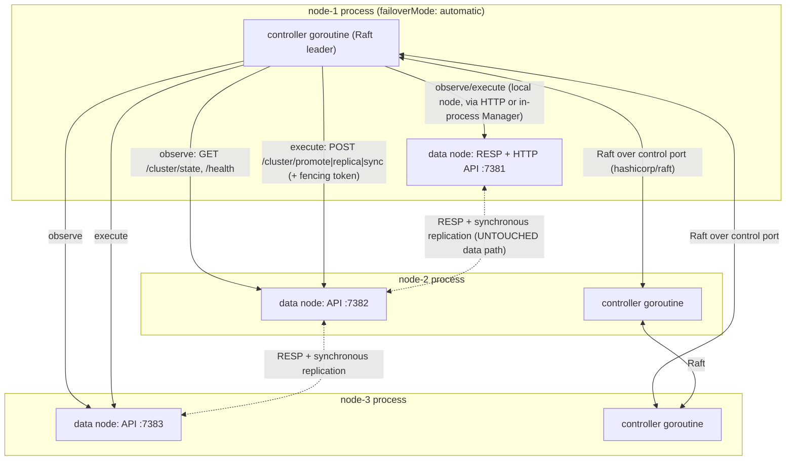

# MnemoKV — Automatic Cluster Recovery: Plan of Action

> **Audience:** an AI coding agent implementing this feature, secondarily a human reviewer.
> **Status:** not started. This document is the authoritative work plan.
> **Last grounded against the codebase:** June 21, 2026.

---

## 0. How To Use This Document

Work **phase by phase, top to bottom**. Each phase has:

- a short **Goal**,
- a **Definition of done**,
- a **Checklist** of concrete tasks.

Do not start a later phase before the earlier one compiles, passes its tests, and leaves the
existing cluster behaviour unchanged. After every phase run the [Verification Baseline](#11-verification-baseline)
and stop on any regression. Mark a task complete only when its code **and** its test exist and pass.

If something contradicts the current code, **the code wins** — re-read the relevant file and adjust
the plan rather than forcing the change. Record any deviation in a short note at the bottom of this
file under "Implementation notes".

---

## 1. Context And Goal

MnemoKV today supports a static **two-to-five-node** cluster with **1024 fixed slots**. Each slot has
one **leader** and one assigned **replica**, an integer **term**, and replication **sequences**.
Writes are synchronous: the leader only mutates after the assigned replica acknowledges
(see [ADR 004](../docs/adr/004-cluster-write-safety.md)). Failover is **manual** today: an operator
must promote the replica, assign a new replica, and run a full-slot sync
(see [ADR 005](../docs/adr/005-failover-semantics.md) and
[developer guide ch.7](../docs/developer-guide/07-cluster-routing-replication-and-failover.md)).

**Goal:** add an **optional, opt-in automatic recovery control plane** that:

1. continuously checks whether nodes are alive,
2. when a leader dies, automatically promotes its replica, assigns a replacement replica, and
   re-syncs it — so clients can keep reading and writing,
3. keeps the cluster reasonably **balanced** (no node owning a disproportionate share of leadership)
   through controlled, safe rebalancing,
4. makes every ownership change only when a **majority of controllers agree** (Raft quorum), so a
   network partition can never produce two leaders for the same slot.

This is a **diploma-quality** feature: it must be correct, well-isolated, well-tested, and
architecturally honest. It does **not** need to be production-hardened.

---

## 2. Locked Design Decisions

These were decided with the project owner. Do not revisit them without asking.

| Decision | Choice | Rationale |
| --- | --- | --- |
| Consensus | **Use an established Raft library: `github.com/hashicorp/raft`** | Battle-tested election + log replication + snapshotting. We focus on the control-plane FSM and the adapter, not on reimplementing consensus. |
| Where it runs | **Embedded in the node.** Each `mnemokv-node` started with `failoverMode: automatic` also runs a **controller goroutine**; those goroutines form the Raft group among themselves over a **dedicated control port**. No separate binary, **one YAML per node**, launched exactly as today. | The user only changes one word (`failoverMode`). The controller still stays off the RESP/HTTP **data** path (its own goroutine + its own port), so isolation is preserved. An embedded goroutine is simpler and safer than spawning a child process. |
| Scope | **Automatic failover *and* automatic rebalancing** | Failover keeps data available; rebalancing keeps leadership load even after failures/replacements. |
| Default state | **Disabled by default** (`failoverMode: manual`) | The existing manual cluster remains the stable default. Nothing changes unless a node's config sets `failoverMode: automatic`. |
| Coupling to data nodes | **Narrow adapter over existing operations** (`Promote`, `AssignReplica`, `SyncReplica`) via the existing HTTP admin API, guarded by a **fencing token / control index** | Reuses proven, idempotent operations. Data nodes need at most one new check before accepting controller-driven metadata changes. The shared touchpoint with existing logic is just the `failoverMode` config switch. |

**Why a library and not from scratch:** the value of this diploma feature is the *control-plane
design* (failure detection, safe planning, idempotent execution, fencing, rebalancing). Raft itself
is a solved problem; delegating it to `hashicorp/raft` reduces consensus bugs and lets the agent
spend effort where the project is judged.

---

## 3. Guardrails (Do Not Break These)

1. **The data path is untouchable.** No controller code may sit on the RESP or HTTP command path.
   The files [`internal/cluster/coordinator.go`](../internal/cluster/coordinator.go),
   [`internal/cluster/replicator.go`](../internal/cluster/replicator.go),
   [`internal/cluster/proxy.go`](../internal/cluster/proxy.go) and the synchronous write contract in
   [ADR 004](../docs/adr/004-cluster-write-safety.md) **must keep working exactly as today**.
2. **Manual failover must keep working** when no controller is present. Existing endpoints
   `/cluster/promote`, `/cluster/replica`, `/cluster/sync` and their `Manager` methods stay
   behaviour-compatible.
3. **Metadata stays authoritative on the nodes.** The controller does **not** become a second source
   of truth for slot ownership. It *drives* the existing metadata operations; the node's
   [`internal/cluster/metadata.go`](../internal/cluster/metadata.go) remains the ownership record.
4. **Off by default.** With `failoverMode: manual` (the default), the controller goroutine never
   starts; `go test ./...` and the existing cluster demo behave identically to before this feature.
   The only shared code path with the existing system is the config switch that decides whether to
   start the controller goroutine.
5. **No quorum, no action.** If the controller group lacks a Raft majority, ownership must remain
   frozen. The controller must never "best-effort" a promotion without a committed decision.
6. **Idempotent, resumable execution.** Every recovery/rebalance step must be safe to repeat after a
   controller crash or leadership change (terms and the fencing token make repeats no-ops).
7. **Additive only.** Prefer new packages/files. Touch existing files only for the few well-defined
   integration points listed in each phase.

---

## 4. Target Architecture



Each node runs both its normal data duties (unchanged) and a controller goroutine. The controller
goroutines elect a Raft leader among themselves; **only the leader's** observer/planner/executor
loops are active. The control-plane Raft traffic uses a **separate control port**, never the RESP
or HTTP data ports.

### Components

- **`cmd/node/main.go` (small, additive wiring)** — after building the cluster manager, if
  `cfg.Cluster.FailoverMode == "automatic"`, start the embedded controller (`internal/controller`)
  as a goroutine and stop it on shutdown. If `manual` (default), do nothing — current behaviour.
- **`internal/controller/` (new package)** — all control-plane logic, fully decoupled from the
  data path:
  - `controller.go` — lifecycle: `Start(ctx)`/`Shutdown(ctx)`, owns the Raft node and the
    leader-only loops. This is the single entry point the node calls.
  - `raftnode.go` — wraps `hashicorp/raft`: transport, log/stable store, snapshot store, bootstrap
    of the node-embedded Raft group over the control port.
  - `fsm.go` — the replicated state machine. Applies committed control decisions to in-memory
    controller state (cluster view, latest recovery plan, executed step markers, fencing token).
  - `observer.go` — polls each data node's `GET /cluster/state` + `/health`, builds a unified view,
    tracks consecutive failures with a failure timeout.
  - `planner.go` — pure functions: from a committed cluster view, produce a `RecoveryPlan` (failover)
    or `RebalancePlan`. No side effects — easy to unit test.
  - `executor.go` — the narrow adapter. Executes a *committed* plan step-by-step against data-node
    HTTP admin endpoints, idempotently, carrying the fencing token. Targets the correct node per
    step (e.g. `sync` must run on the slot's current leader).
  - `nodeclient.go` — typed HTTP client for the existing node API (`/cluster/state`, `/cluster/promote`,
    `/cluster/replica`, `/cluster/sync`, `/health`).
  - `types.go` — `ClusterView`, `RecoveryPlan`, `RebalancePlan`, `PlanStep`, Raft `Command` envelope.
- **`internal/config/` (extend)** — add a `controller` sub-block under the existing cluster config
  (control port, raft dir, timeouts, `rebalanceEnabled`, thresholds) and a node-side `controlPlane`
  fencing toggle. The **trigger remains the existing `failoverMode` field**.
- **Data-node fencing hook (small, additive)** — nodes optionally require a non-decreasing
  **control index / fencing token** before applying controller-driven admin changes, so a stale
  controller leader cannot rewind ownership.

### Control flow (failover, happy path)

```text
observer (controller leader) polls nodes
  -> node-X leader unreachable for failureTimeout
  -> planner builds RecoveryPlan{ for each slot owned by node-X:
        promote replica, assign new replica, sync }
  -> leader proposes Command{Propose, planID, plan} via raft.Apply()
  -> Raft commits to a majority -> FSM stores plan as "active"
  -> executor reads active plan from FSM, runs steps in order:
        POST /cluster/promote {slot}            (idempotent: stale term => no-op)
        POST /cluster/replica  {slot, newNode}
        POST /cluster/sync     {slot, newNode}
        each carries fencing token = committed control index
  -> after each step succeeds, leader proposes Command{StepDone, planID, stepIdx}
  -> when all steps done, leader proposes Command{PlanComplete, planID}
  -> if leader crashes mid-plan, new leader resumes from last committed StepDone
```

Because there are 1024 slots, a single dead node usually affects **many slots**. The plan is a list
of per-slot steps; the executor iterates them. Each underlying operation already exists and is
single-slot.

---

## 5. Key Interfaces And Data Contracts

> Names are suggestions; keep them consistent once chosen.

```go
// internal/controller/types.go

// ClusterView is the controller's deduced picture of the data cluster,
// assembled from each node's GET /cluster/state and /health.
type ClusterView struct {
    MetadataVersion uint64
    Slots           []SlotView          // one per slot (leader, replica, term, ready)
    Nodes           map[string]NodeView // nodeID -> liveness/role counts
    ObservedAt      time.Time
}

type NodeView struct {
    ID            string
    Reachable     bool
    ConsecFails   int
    LeaderSlots   int
    ReplicaSlots  int
}

type PlanStep struct {
    Kind   StepKind // Promote | AssignReplica | Sync
    Slot   uint32
    Target string   // node to promote-to / assign as replica
}

type RecoveryPlan struct {
    ID      string
    Reason  string // "leader-down:node-2"
    DeadNode string
    Steps   []PlanStep
    Done    map[int]bool // committed step completion markers
}

// Raft FSM command envelope (the ONLY thing Raft replicates).
type Command struct {
    Type    CommandType // ObserveView | ProposePlan | StepDone | PlanComplete | RebalancePlan
    Payload json.RawMessage
}
```

**Fencing token:** define it as the Raft **commit index** (or a monotonically increasing controller
epoch persisted in the FSM). It is attached to every admin call as an HTTP header, e.g.
`X-MnemoKV-Control-Index: <n>`. A node records the highest control index it has accepted and rejects
admin requests carrying a **lower** index. The controller leader always sends a value `>=` the last
one it committed. Manual admin calls (no header) keep working when `controlPlane.requireFencing` is
false (the default), preserving backward compatibility.

---

## 6. Phase 0 — Scaffolding, Config Gating, And A No-Op Embedded Controller

**Goal:** a buildable, disabled-by-default skeleton that changes nothing at runtime.

**Definition of done:** `go build ./...` and `go test ./...` pass; running the existing cluster demo
behaves exactly as before; a node started with `failoverMode: automatic` starts a no-op controller
goroutine and shuts it down cleanly, while `failoverMode: manual` starts nothing new.

- [ ] Add dependency `github.com/hashicorp/raft` (and `github.com/hashicorp/raft-boltdb` for the log/stable store) to `go.mod`; run `go mod tidy`.
- [ ] Extend `internal/config` ([`config.go`](../internal/config/config.go)):
  - [ ] Add a `Controller ControllerConfig` sub-block under `ClusterConfig` (`ControlPort int`, `RaftDir string`, observe/failure timeouts, `RebalanceEnabled bool` default false, skew thresholds). The **on/off trigger stays the existing `FailoverMode` field** (`manual` | `automatic`).
  - [ ] Add an optional per-peer control address (reuse `PeerConfig`, e.g. a `controlAddress`/raft port) so the embedded Raft group knows where each peer's control port is.
  - [ ] Node-side `ControlPlaneConfig` (`RequireFencing bool`, default false), wired through validation in [`internal/config/validate.go`](../internal/config/validate.go). Validate that `automatic` requires control ports for all peers.
- [ ] Create `internal/controller/` with `doc.go` (package boundary + guardrails from §3) and `controller.go` exposing `New(...)`, `Start(ctx)`, `Shutdown(ctx)` as stubs (no Raft yet).
- [ ] Wire into [`cmd/node/main.go`](../cmd/node/main.go): after `clusterMgr.Start(ctx)`, if `cfg.Cluster.Enabled && cfg.Cluster.FailoverMode == "automatic"`, construct and `Start` the controller; add it to the shutdown sequence. Manual mode path is untouched.
- [ ] Add a commented `controller:` sub-block (disabled defaults) plus a `controlPlane:` block to the cluster node configs ([`configs/cluster-node-*.yaml`](../configs/)); keep them on `failoverMode: manual`. Optionally add `configs/cluster-node-1-auto.yaml` (etc.) that differ from the existing ones **only** by `failoverMode: automatic` + control ports, to prove the "one word" switch.
- [ ] **Verify:** existing tests + cluster demo unchanged; an `automatic` node boots and shuts down cleanly with the stub.

---

## 7. Phase 1 — Raft Node And FSM (In-Memory Transport First)

**Goal:** a working 3-member Raft group with a control-plane FSM, testable entirely in-process.

**Definition of done:** a unit test boots 3 in-memory Raft nodes, elects a leader, applies a
`Command`, and observes the FSM state converge on all three.

- [ ] `internal/controller/fsm.go`: implement `raft.FSM` (`Apply`, `Snapshot`, `Restore`). FSM state holds: latest `ClusterView`, the `active` plan (if any), per-step `Done` markers, the current fencing/control index, and rebalance bookkeeping. `Apply` must be deterministic and side-effect-free (no network calls).
- [ ] `internal/controller/raftnode.go`: construct `raft.Raft` with `raft.NetworkTransport` over the configured **control port** **and** an injectable transport so tests can use `raft.InmemTransport`. Use `raft-boltdb` for log+stable store under `RaftDir`, `raft.NewInmemStore` in tests. Support bootstrap of a fresh node-embedded group (peers from cluster config) and rejoin after restart.
- [ ] Provide a thin API: `Propose(cmd Command) error` (leader-only, returns error if not leader), `IsLeader() bool`, `LeaderCh()`, `State() FSMSnapshot`.
- [ ] `internal/controller/fsm_test.go`: 3 in-memory nodes; assert election, `Apply` replication, snapshot+restore round-trip, and that a follower rejects `Propose`.
- [ ] **Verify:** new tests pass; nothing else affected.

---

## 8. Phase 2 — Node Observation

**Goal:** the controller leader builds an accurate `ClusterView` from the live data nodes.

**Definition of done:** against fake HTTP servers returning canned `/cluster/state` payloads, the
observer produces the correct `ClusterView`, including per-node leader/replica counts and
consecutive-failure tracking.

- [ ] `internal/controller/nodeclient.go`: typed client for `GET /health` and `GET /cluster/state` (shapes mirror [`internal/api/dto.go`](../internal/api/dto.go) `ClusterStateResponse`/`SlotStatus`). Short timeouts; never block the loop.
- [ ] `internal/controller/observer.go`: poll every `observeInterval`; mark a node failed after `failureTimeout` / N consecutive misses; aggregate the highest `metadataVersion` seen; derive per-node `LeaderSlots`/`ReplicaSlots`.
- [ ] The leader periodically proposes `Command{ObserveView, view}` so the **committed** view (not a transient local read) is what planning uses. Tune frequency to avoid log spam (e.g. only when the view materially changes).
- [ ] `internal/controller/observer_test.go`: spin up `httptest` servers; verify view assembly, failure counting, recovery (node comes back), and handling of disagreeing metadata versions (pick the highest / quorum-consistent one).
- [ ] **Verify.**

---

## 9. Phase 3 — Failure Detection And Plan Proposal (Failover Planner)

**Goal:** turn a committed `ClusterView` with a dead leader into a correct, minimal `RecoveryPlan`.

**Definition of done:** `planner` unit tests cover: healthy cluster → no plan; dead leader with ready
replica → promote+assign+sync steps for every affected slot; dead node that is only a *replica* →
assign+sync replacement (no promotion); dead node with **no quorum of controllers** → no execution
(guarded in the executor, but planner still produces the plan deterministically).

- [ ] `internal/controller/planner.go` — **pure** functions:
  - [ ] `PlanFailover(view) (RecoveryPlan, bool)`: for each slot whose leader is the dead node, emit `Promote(slot)` → `AssignReplica(slot, newReplica)` → `Sync(slot, newReplica)`. For each slot whose *replica* is the dead node (leader alive), emit `AssignReplica` → `Sync` only.
  - [ ] Replica-target selection: choose the **least-loaded healthy node** that is not the slot's leader, to avoid piling replicas on one node. Deterministic tie-break by node ID so all controllers agree.
  - [ ] Refuse to plan if the would-be replica/promotion target is itself unhealthy; if no safe target exists, mark the slot `degraded` in the plan and skip (availability preserved on the new leader even without a replica; record it for a later rebalance pass).
- [ ] Wire into the leader loop: when the committed view shows a node failed past timeout and there is **no active plan**, `Propose(ProposePlan)`. Guard with quorum (Raft `Apply` only succeeds with majority — this *is* the quorum gate).
- [ ] `internal/controller/planner_test.go`: table-driven cases listed in "Definition of done".
- [ ] **Verify.**

---

## 10. Phase 4 — Recovery Execution Adapter (Idempotent, Resumable)

**Goal:** the leader executes a committed plan against the data nodes using existing operations, and
resumes correctly after a crash or leadership change.

**Definition of done:** an integration-style test (fake node servers backed by the real
`Manager` in-process, see §12) drives a full failover to completion; killing/replacing the executor
mid-plan resumes without duplicate or conflicting changes.

- [ ] `internal/controller/executor.go`: iterate the active plan's steps **in committed order**, skipping steps already marked `Done` in the FSM. For each step call the matching node endpoint via `nodeclient`:
  - `Promote` → `POST /cluster/promote {slot}` on the surviving owner/any node that holds authoritative metadata.
  - `AssignReplica` → `POST /cluster/replica {slot, nodeId}`.
  - `Sync` → `POST /cluster/sync {slot, nodeId}`.
- [ ] Attach the fencing header `X-MnemoKV-Control-Index` = current committed control index on every call.
- [ ] **Idempotency:** treat "already promoted / stale term / already-leader" responses as success (the underlying ops already fence on term — re-issuing is a no-op). After a step succeeds, `Propose(StepDone)`. After the last, `Propose(PlanComplete)` and clear the active plan.
- [ ] **Resumability:** on becoming leader, if the FSM has an active plan, continue from the first not-`Done` step. Never restart a completed plan.
- [ ] **Backpressure / safety:** execute one slot's step sequence before the next where ordering matters; cap concurrency; bounded retries with backoff; abandon-and-replan only on a newer committed view.
- [ ] `internal/controller/executor_test.go`: full failover; mid-plan leadership change; duplicate plan suppression; a node that 500s then recovers.
- [ ] **Verify.**

---

## 11. Phase 5 — Data-Node Fencing Hook (Minimal, Additive)

**Goal:** prevent a stale controller leader (after a partition heals) from rewinding ownership.

**Definition of done:** with `controlPlane.requireFencing: true`, a node rejects an admin call whose
control index is lower than the highest it has accepted; with the default `false`, manual admin and
all existing tests behave exactly as today.

- [ ] In [`internal/api/cluster_admin.go`](../internal/api/cluster_admin.go), read the optional `X-MnemoKV-Control-Index` header in the promote/replica/sync handlers.
- [ ] Store the highest accepted control index on the node (in `Manager`/`Metadata`, persisted with the existing cluster metadata snapshot so it survives restart). Reject lower values with `409`/`TRYAGAIN`-style responses **only when `requireFencing` is enabled**.
- [ ] When fencing is disabled (default), ignore the header entirely — zero behaviour change.
- [ ] Tests: fencing on → stale index rejected, equal/higher accepted, value persists across restart; fencing off → header ignored.
- [ ] **Verify:** existing `internal/api` and `test/failover` suites still green.

---

## 12. Phase 6 — In-Process Multi-Node Test Harness

**Goal:** a deterministic harness that runs the controller against real data-node `Manager`s without
spawning OS processes, for fast, reliable CI-style tests.

**Definition of done:** a single Go test boots N in-process nodes (reuse patterns from
[`test/cluster/cluster_test.go`](../test/cluster/cluster_test.go)) + a 3-node in-memory Raft
controller group, injects a node failure, and asserts the cluster auto-recovers (a previously-failed
slot becomes writable again).

- [ ] Build a harness helper under `test/controller/` (or `internal/controller/harness_test.go`) that wires real `cluster.Manager` instances behind `httptest` servers exposing the existing API routes.
- [ ] Use `raft.InmemTransport` for the controller group so no ports/timers flake.
- [ ] Scenario tests:
  - [ ] **Leader death → auto-failover:** write key, kill its slot leader, assert reads/writes succeed again after recovery, on the promoted node.
  - [ ] **Minority partition of controllers:** isolate 1 node's controller → group still recovers; isolate 2 → **no ownership change** (quorum lost). Note: in the embedded model a node failure removes both its data role *and* its controller vote, so test these independently too (controller-only partition vs. full node death).
  - [ ] **Duplicate/stale plan:** ensure a second proposal for an already-handled failure is a no-op.
  - [ ] **Restart during repair:** leadership changes mid-`Sync`; recovery completes exactly once.
  - [ ] **Stale node rejoin:** the dead node returns with old metadata; fencing + existing metadata-version rules prevent it reclaiming leadership.
- [ ] **Verify** with `go test -race ./internal/controller/... ./test/controller/...`.

---

## 13. Phase 7 — Automatic Rebalancing

**Goal:** after failures/replacements, keep **leadership and replica load even** across healthy nodes,
without ever sacrificing the write-safety contract.

**Definition of done:** given a skewed but healthy cluster (e.g. one node leads far more slots than
others after a failover), the controller proposes and executes a bounded set of moves that reduces
the imbalance below a configured threshold, with no write unavailability beyond the brief per-slot
sync window, and only when the cluster is fully healthy and stable.

- [ ] `planner.go`: add `PlanRebalance(view) (RebalancePlan, bool)`. Compute per-node leader/replica counts; if `max-min > threshold` (config `rebalanceSkewThreshold`), generate a **small, capped** number of moves (e.g. reassign a slot's replica to an under-loaded node, then promote it in a controlled hand-off) chosen deterministically.
- [ ] **Safety gates:** only rebalance when (a) no active recovery plan, (b) all nodes healthy for a cooldown window, (c) every move keeps each slot with a ready leader and a healthy replica throughout. Never move a slot whose replica isn't `ReplicaReady`.
- [ ] Reuse the executor: a rebalance move is expressed as the same `AssignReplica` → `Sync` (→ optional controlled `Promote`) primitives, fenced and idempotent.
- [ ] Make rebalancing independently toggleable (`controller.rebalanceEnabled`, default **false**) so failover can ship and be graded on its own.
- [ ] Tests: skew detection thresholds; capped move generation; refusal to rebalance while degraded; convergence to within threshold; no data loss / no write-safety violation during moves.
- [ ] **Verify.**

---

## 14. Phase 8 — Observability, Docs, And Demo

**Goal:** make the feature visible, explainable, and demonstrable; document it like the rest of the
project.

**Definition of done:** a controller status endpoint exists; an ADR records the decision; the
developer guide and Next_Steps are updated; a repeatable demo shows a node dying and the cluster
self-healing.

- [ ] Add a controller HTTP status endpoint (e.g. `GET /controller/state` on the existing node API, populated only on the controller's Raft leader: Raft leader ID, term, current view, active plan + step progress, last rebalance). Read-only.
- [ ] Optional, only if cheap: surface "auto-recovery in progress" in the existing node `/cluster/state` (e.g. reuse the `recovering` membership state) and/or the React cluster page. Do **not** block earlier phases on frontend work.
- [ ] Write **ADR 006: automatic recovery control plane** under [`docs/adr/`](../docs/adr/) — scope, embedded-in-node topology gated by `failoverMode`, Raft-via-library choice, fencing, quorum-or-nothing, relationship to manual failover (ADR 005 stays valid; this is opt-in and additive).
- [ ] Update [`docs/developer-guide/07-cluster-routing-replication-and-failover.md`](../docs/developer-guide/07-cluster-routing-replication-and-failover.md) with a new section pointing to `internal/controller/` and clarifying that manual failover remains the default and that `failoverMode: automatic` is the single switch.
- [ ] Add a demo script under [`scripts/`](../scripts/) (mirror `demo-cluster.ps1` / `run-cluster.sh`) that starts the **same** cluster but with `failoverMode: automatic` configs, kills a leader node, and shows automatic recovery — launched with the exact same commands as the manual demo. Add a short walkthrough section to [`Run_And_Use.md`](Run_And_Use.md).
- [ ] Update [`Next_Steps.md`](Next_Steps.md) to move "Experimental Automatic Cluster Recovery" from proposal to implemented (with any honest limitations).
- [ ] Update repo memory `/memories/repo/mnemokv-conventions.md` with the new package boundary and how to run controller tests.

---

## 15. Testing Strategy (Summary)

| Layer | What | How |
| --- | --- | --- |
| Raft/FSM | election, replication, snapshot/restore, leader-only propose | in-memory transport unit tests (Phase 1) |
| Observer | view assembly, failure timeout, recovery, version disagreement | `httptest` fakes (Phase 2) |
| Planner | failover + rebalance plan correctness (pure) | table-driven unit tests (Phases 3, 7) |
| Executor | idempotency, resumability, fencing, retries | in-process integration (Phase 4) |
| End-to-end | leader death, minority partition, duplicate plan, restart-during-repair, stale rejoin, rebalance convergence | in-process harness with real `Manager`s + in-memory Raft (Phases 6, 7) |
| Regression | existing cluster/data path unchanged | full `go test ./...` every phase |

Run concurrency-sensitive suites with `-race`. Keep all controller tests **process-free and
timer-tolerant** (injectable clocks / in-memory transport) so they don't flake in CI.

---

## 16. Verification Baseline (Run After Every Phase)

Backend (always):

```bash
go build ./...
go test ./...
go test -race ./internal/controller/... ./internal/cluster/... ./internal/api/...
```

Cluster integrity (when cluster/controller code changed):

```bash
go test ./test/cluster/... ./test/failover/... ./test/controller/...
```

Existing demos must still behave identically when the controller is **not** running. Do not modify
frontend build/lint flow unless Phase 8's optional UI work is undertaken; if it is, follow the
frontend baseline in [Next_Steps.md](Next_Steps.md).

---

## 17. Risks And Mitigations

| Risk | Mitigation |
| --- | --- |
| Controller touches the data path and regresses cluster behaviour | Hard guardrail §3.1; the controller is a self-contained package on its own goroutine + control port; no imports from `internal/controller` into the RESP/HTTP command path; the only node-side hook is the `failoverMode` switch and the optional fencing check. |
| Split-brain (two leaders for a slot) | Quorum-or-nothing (§3.5) + fencing token (Phase 5) + existing term fencing in `metadata.go`. |
| 1024-slot plans are large/slow | Plan is per-slot steps; cap concurrency; idempotent re-issue; only changed views trigger new plans. |
| Embedded model: a node death removes a controller vote too | Size the quorum for the cluster (e.g. 3+ nodes so one death keeps a controller majority); document that 2-node clusters cannot self-heal (no quorum) and fall back to manual. |
| Flaky tests from real ports/timers | In-memory Raft transport + `httptest` + injectable clocks (Phases 1, 6). |
| Rebalancing causes churn or unavailability | Strict safety gates, cooldown, capped moves, off by default (Phase 7). |
| Library learning curve (`hashicorp/raft`) | Phase 1 is isolated and fully unit-tested before any node integration. |

---

## 18. Out Of Scope

- Dynamic cluster membership changes for **data** nodes (still static 2–5 nodes).
- Cross-slot transactions or global flush in cluster mode (unchanged; still rejected).
- Disk-durability/quorum guarantees for data writes beyond the existing ADR 004 contract.
- Geo-distribution, multi-region, or production hardening.

---

## 19. Implementation Notes (fill in as you go)

- _Record deviations from this plan, surprises in the codebase, and decisions made here._
