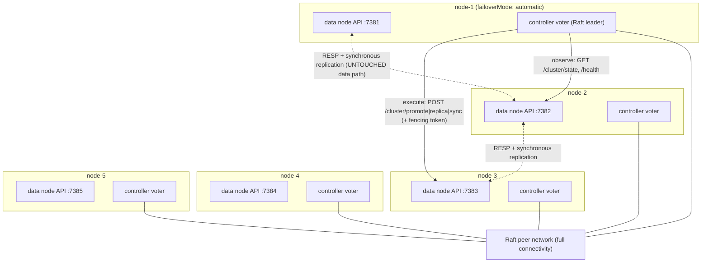

# MnemoKV — Automatic Cluster Recovery: Plan of Action

> **Audience:** an AI coding agent implementing this feature, secondarily a human reviewer.
> **Status:** not started. This document is the authoritative work plan.
> **Last grounded against the codebase:** June 21, 2026.

---

## 0. How To Use This Document

Work **phase by phase, top to bottom**. Each phase has:

- a short **Goal**,
- a **Definition of done**,
- a **Checklist** of concrete tasks.

Do not start a later phase before the earlier one compiles, passes its tests, and leaves the
existing cluster behaviour unchanged. After every phase run the [Verification Baseline](#21-verification-baseline)
and stop on any regression. Mark a task complete only when its code **and** its test exist and pass.

If something contradicts the current code, **the code wins** — re-read the relevant file and adjust
the plan rather than forcing the change. Record any deviation in a short note at the bottom of this
file under "Implementation notes".

---

## 1. Context, Goal, And The Recovery Contract

MnemoKV today supports a static **two-to-five-node** cluster with **1024 fixed slots**. Each slot has
one **leader** and one assigned **replica**, an integer **term**, and replication **sequences**.
Writes are synchronous: the leader only mutates after the assigned replica acknowledges
(see [ADR 004](../docs/adr/004-cluster-write-safety.md)). Failover is **manual** today: an operator
must promote the replica, assign a new replica, and run a full-slot sync
(see [ADR 005](../docs/adr/005-failover-semantics.md) and
[developer guide ch.7](../docs/developer-guide/07-cluster-routing-replication-and-failover.md)).

**Goal:** add an **opt-in automatic recovery control plane** that turns the manual cluster into a
self-healing one. In automatic mode the controller must:

1. continuously **check node liveness**;
2. on a node failure, **promote** a surviving replica for every slot left leaderless;
3. **repair** redundancy by assigning and synchronizing a **replacement replica** for every affected
   slot — both slots that lost their *leader* and slots that lost their *replica*;
4. **rebalance** leadership and replica placement across the surviving nodes so load stays even;
5. make every ownership change only through a **Raft-committed** decision (quorum-or-nothing).

**Promotion, repair, and rebalancing are all mandatory.** Promotion alone restores *access* to data
but not the *two-copy redundancy guarantee*. The cluster is not `healthy` again until **every slot
has a reachable leader and a ready replica on distinct nodes, the failed node owns no slots, and
leader/replica counts are reasonably balanced** across the surviving nodes. Only then can the cluster
absorb another failure.

### Slots are redistributed, not reindexed

There are always **1024 fixed slots**. Recovery never changes the slot count or re-hashes keys. It
only changes **which node owns each existing slot**. A key keeps its hash-slot number forever;
rebalancing moves *complete slots and their data* between nodes.

### The recovery contract (the guarantee)

> MnemoKV automatic recovery uses one leader and one synchronous replica per slot. It tolerates
> **one data-node failure at a time**. After a failure the controller promotes surviving replicas,
> restores missing replicas, synchronizes affected slots, and rebalances placement across the
> healthy nodes. Once the cluster returns to `healthy`, it can tolerate another node failure. A
> second failure **before repair completes** may make slots unavailable or cause **potential data
> loss** if it removes their final surviving copy. The system must expose this degraded window and
> must **never silently recreate unavailable slots as empty**.

Two independent guarantees, never conflated:

- **Control plane (Raft):** 5 voters tolerate up to **2** unavailable voters (3 remain → quorum).
- **Data plane (replication factor 2):** one leader + one replica tolerate **1** failure at a time,
  *provided repair completes before the next destructive failure*. Raft preserves metadata; it does
  **not** hold user data, so control-plane fault tolerance does not extend the data-plane's
  one-at-a-time limit.

This is a **diploma-quality** feature: it must be correct, well-isolated, well-tested, and
architecturally honest. It does **not** need to be production-hardened.

---

## 2. Locked Design Decisions

These were decided with the project owner. Do not revisit them without asking.

| Decision | Choice | Rationale |
| --- | --- | --- |
| Consensus | **Use an established Raft library: `github.com/hashicorp/raft`** | Battle-tested election + log replication + snapshotting. We focus on the control-plane FSM and the adapter, not on reimplementing consensus. |
| Where it runs | **Embedded in the node.** Each `mnemokv-node` started with `failoverMode: automatic` also runs a **controller goroutine** holding a **Raft voter**; those goroutines form the Raft group among themselves over a **dedicated control port**. No separate binary, **one YAML per node**, launched exactly as today. | `failoverMode` is the mode selector, while automatic configs also provide the required control addresses, Raft directory, bootstrap identity, and signing secret. The controller stays off the RESP/HTTP **data** path (its own goroutine + port), preserving isolation. |
| Standard topology | **5 nodes** is the standard automatic-mode topology and the documented guarantee/demo. Automatic recovery **requires ≥3 nodes** (control quorum); with fewer the controller refuses to enable and logs that manual mode is required. | 5 voters survive 2 losses, so the control plane stays available across *sequential* failures; 3 voters lose quorum on a 2nd loss. |
| Scope | **Failover *and* repair *and* rebalancing — all mandatory** in automatic mode. There is **no switch to disable rebalancing.** | Recovery is not complete until both redundancy *and* balance are restored. |
| Default state | **Disabled by default** (`failoverMode: manual`) | The existing manual cluster remains the stable default. Nothing changes unless a node's config sets `failoverMode: automatic`. |
| Mode exclusivity | In automatic mode the Raft controller has **exclusive topology authority**. Manual promote/assign/sync endpoints and CLI commands are **rejected** while automatic mode is active; read-only status and diagnostics stay available. `failoverMode` is **static startup configuration**: there is no runtime mode switch. Changing modes requires a fully `healthy` cluster, a clean shutdown of every node, consistent config changes on every node, and a full-cluster restart. | Prevents operators and Raft from committing conflicting ownership changes. |
| Returning node | A node that returns keeps its configured node/Raft identity but rejoins as a **fresh, empty data node**. Its old application data and obsolete application snapshots are never trusted or merged. It fetches current metadata, becomes eligible only after validation, and receives leaders/replicas solely through normal full-slot synchronization during automatic **4→5** rebalancing. | Safe, simple restoration with no stale-key merge or snapshot conflict resolution. Returning data does not recover slots already marked `potential_data_loss`. |
| Coupling to data nodes | **Narrow adapter over existing operations** (`Promote`, `AssignReplica`, `SyncReplica`) via the existing HTTP admin API. Controller calls carry a monotonic **control index** and an authenticated request signature derived from a configured shared controller secret. | Reuses proven, idempotent operations while preventing forged high fencing indexes through the public admin API. |

**Why a library and not from scratch:** the value of this diploma feature is the *control-plane
design* (failure detection, safe planning, idempotent execution, fencing, rebalancing). Raft itself
is a solved problem; delegating it to `hashicorp/raft` reduces consensus bugs and lets the agent
spend effort where the project is judged.

---

## 3. Guardrails (Do Not Break These)

1. **The data path is untouchable.** No controller code may sit on the RESP or HTTP command path.
   The files [`internal/cluster/coordinator.go`](../internal/cluster/coordinator.go),
   [`internal/cluster/replicator.go`](../internal/cluster/replicator.go),
   [`internal/cluster/proxy.go`](../internal/cluster/proxy.go) and the synchronous write contract in
   [ADR 004](../docs/adr/004-cluster-write-safety.md) **must keep working exactly as today**.
2. **Manual failover must keep working in manual mode.** Existing endpoints `/cluster/promote`,
   `/cluster/replica`, `/cluster/sync` and their `Manager` methods stay behaviour-compatible when
   `failoverMode: manual`. In **automatic** mode those topology-changing endpoints are **rejected**
   (mode exclusivity, §2); only the controller changes ownership.
3. **Metadata stays authoritative on the nodes.** The controller does **not** become a second source
   of truth for slot ownership. It *drives* the existing metadata operations; the node's
   [`internal/cluster/metadata.go`](../internal/cluster/metadata.go) remains the ownership record.
4. **Off by default.** With `failoverMode: manual` (the default), the controller goroutine never
   starts; `go test ./...` and the existing cluster demo behave identically to before this feature.
5. **No quorum, no action.** If the controller group lacks a Raft majority, ownership must remain
   frozen. The controller must never "best-effort" a promotion without a committed decision.
6. **Idempotent, resumable execution.** Every recovery/rebalance step must be safe to repeat after a
   controller crash or leadership change; terms fence stale work and exact postcondition checks make
   repeats safe before `StepDone` is committed.
7. **Additive only.** Prefer new packages/files. Touch existing files only for the few well-defined
   integration points listed in each phase.
8. **`healthy` means fully repaired *and* balanced.** Restoring access (promotion) is not the end
   state. The cluster only returns to `healthy` once every slot has a leader and a ready replica on
   distinct nodes, the failed node owns zero slots, and load is reasonably even.
9. **Never recreate an unavailable slot as empty.** If every authoritative copy of a slot is
   unreachable, mark it `unavailable` / `potential_data_loss`. Never reinitialize it or assign a
   fresh empty leader — that would turn missing data into a false "successful recovery".
10. **Reads-only honesty during degradation.** Under ADR 004 a promoted leader with **no ready
    replica** may serve **reads** but **must reject writes** until a replacement replica is synced and
    marked ready. Automatic failover therefore gives *bounded recovery*, not uninterrupted writes for
    every affected slot. Unaffected slots keep serving normally.
11. **The failed node is excluded from placement, not deleted from membership.** It stays a known,
    configured peer (eligible to return) but receives **zero** slot assignments while unavailable.

---

## 4. Topology Model

The controller must reason about four distinct node sets. Conflating them is the root of most of the
bugs this plan guards against.

| Set | Meaning |
| --- | --- |
| **Configured nodes** | All known peers from the cluster config (e.g. the five `node-1..5`). Static; a failure does not remove a node from this list. |
| **Controller voters** | Nodes participating in the Raft control group. In the embedded model this equals the configured nodes that run a controller. Quorum is computed over this set. |
| **Eligible data nodes** | Currently healthy nodes **allowed to own slots** (leader or replica). This is the *effective active topology* used for all placement decisions. |
| **Unavailable nodes** | Known but **excluded from placement** because they are failed, stale, joining, or not yet synchronized. |

After `node-1` fails, the cluster becomes an **effective four-node data cluster**: configured
membership still lists `node-1` (as `unavailable`), but `node-1` owns no slots and all 1024 slots are
distributed across the eligible nodes `node-2..5`. With even distribution each surviving node leads
≈256 slots and replicates ≈256 *other* slots. This is "1024 leader assignments and 1024 replica
assignments spread evenly over four nodes", **not** "four active nodes and four replicas".

**Placement invariants** (the planner/executor must always preserve these):

- a slot's leader and replica are always **different** nodes;
- failed, stale, joining, or unsynchronized nodes **cannot** receive ownership;
- replacement replicas are chosen using current per-node leader/replica load (least-loaded eligible
  node, deterministic tie-break by node ID so all controllers agree);
- slot ownership is distributed approximately evenly; a node may lead some slots while replicating
  slots led by other nodes;
- synchronization **completes** before a new replica is marked ready;
- source data remains available until the destination is verified;
- migrations are **rate-limited** so recovery does not overwhelm the cluster. Restoring two copies
  for every slot is the first priority; perfect balance is secondary.

---

## 5. Cluster Status And Slot Classification

The degraded window must be **visible** the moment a node fails. The controller exposes a
cluster-level status and a per-slot classification.

### Cluster status states

```text
healthy → failure_suspected → degraded → promoting → repairing → rebalancing → healthy
                                   └────────────→ unavailable / potential_data_loss
```

- `healthy` — every slot has a leader and a ready replica on distinct nodes; balanced.
- `failure_suspected` — a node missed heartbeats but the failure timeout has not elapsed.
- `degraded` — a confirmed failure; redundancy reduced; recovery starting.
- `promoting` / `repairing` / `rebalancing` — active recovery stages (see §8).
- `unavailable` — one or more slots have no reachable leader.
- `potential_data_loss` — one or more slots have **no currently reachable authoritative copy**
  (both owners unreachable). Not yet declared *permanent* loss.

### Per-slot classification on a failure

For every slot, the controller classifies the impact (this drives the plan and prevents the
"empty leader" mistake):

| Case | Condition | Action |
| --- | --- | --- |
| **Unaffected** | both owners available | nothing |
| **Leaderless** | leader failed, replica alive | promote replica, then repair a new replica |
| **Replica-lost** | replica failed, leader alive | data safe; assign + sync a new replica |
| **No surviving copy** | both owners unavailable | **do not** assign a new leader; mark `unavailable` / `potential_data_loss` |

### What the status payload must report

- failed and suspected nodes;
- affected slot ranges;
- slots with only **one** available copy (degraded redundancy);
- slots with **no** currently available copy (potential data loss);
- promotion / repair / synchronization progress;
- the latest committed recovery operation;
- a warning that another failure may cause unavailability or data loss;
- for unavailable slots: former leader and replica, which failures caused it, that v1 does not trust
  returning-node data for recovery, and which commands are being rejected.

**Potential loss in v1.** When both owners are unreachable the system knows only that no copy is
currently reachable, so it reports `potential_data_loss`: `slot unavailable — no authoritative copy
currently reachable; data may be lost`. The first version deliberately does not inspect or merge old
data when either node returns; returning nodes are cleared and re-admitted as fresh data members.
Therefore a return does not clear this warning or recover the unavailable slot automatically.

---

## 6. Target Architecture



> The standard automatic-mode cluster is **5 nodes** (§2). Each node runs its normal data duties
> (unchanged) **and** a controller voter. The voters elect a Raft leader among themselves; **only the
> leader's** observer/planner/executor loops are active. Control-plane Raft traffic uses a **separate
> control port**, never the RESP or HTTP data ports. Five voters keep quorum after two voter losses,
> which is what lets the control plane survive *sequential* node failures.

### Components

- **`cmd/node/main.go` (small, additive wiring)** — after building the cluster manager, if
  `cfg.Cluster.FailoverMode == "automatic"`, start the embedded controller (`internal/controller`)
  as a goroutine and stop it on shutdown. If `manual` (default), do nothing — current behaviour.
- **`internal/controller/` (new package)** — all control-plane logic, fully decoupled from the
  data path:
  - `controller.go` — lifecycle: `Start(ctx)`/`Shutdown(ctx)`, owns the Raft node and the
    leader-only loops. This is the single entry point the node calls.
  - `raftnode.go` — wraps `hashicorp/raft`: transport, log/stable store, snapshot store, bootstrap
    of the node-embedded Raft group over the control port.
  - `fsm.go` — the replicated state machine. Applies committed control decisions to in-memory
    controller state (cluster view, latest recovery plan, executed step markers, fencing token).
  - `observer.go` — polls each data node's `GET /cluster/state` + `/health`, builds a unified view,
    tracks consecutive failures with a failure timeout.
  - `planner.go` — pure functions: from a committed cluster view, classify every slot (§5) and
    produce a `RecoveryPlan` (promotion + repair) or `RebalancePlan`. No side effects — unit-testable.
  - `executor.go` — the narrow adapter. Executes a *committed* plan step-by-step against data-node
    HTTP admin endpoints, idempotently, carrying the fencing token. Targets the correct node per
    step (e.g. `sync` must run on the slot's current leader).
  - `topology.go` — derives configured / voter / eligible / unavailable sets (§4) and per-node load.
  - `nodeclient.go` — typed HTTP client for the existing node API (`/cluster/state`, `/cluster/promote`,
    `/cluster/replica`, `/cluster/sync`, `/health`).
  - `types.go` — `ClusterView`, `RecoveryPlan`, `RebalancePlan`, `PlanStep`, slot classification,
    cluster status, Raft `Command` envelope.
- **`internal/config/` (extend)** — add a `controller` sub-block under the existing cluster config
  (control port, raft dir, timeouts, rebalance skew threshold, migration rate limit) and a node-side
  `controlPlane` block, including a shared request-signing secret. **Rebalancing has no enable/disable flag** — in automatic mode it always
  runs. The on/off **trigger remains the existing `failoverMode` field**.
- **Data-node fencing + mode hook (small, additive)** — nodes require a valid controller HMAC and a
  non-decreasing **control index / fencing token** before applying controller-driven admin changes
  (so callers cannot forge controller authority and a stale leader cannot rewind ownership), and
  **reject manual topology endpoints while in automatic mode**.

### Control flow (failover, happy path)

```text
observer (controller leader) polls nodes
  -> node-X leader unreachable for failureTimeout
  -> planner builds RecoveryPlan{ for each slot owned by node-X:
        promote replica, assign new replica, sync }
  -> leader proposes Command{Propose, planID, plan} via raft.Apply()
  -> Raft commits to a majority -> FSM stores plan as "active"
  -> executor reads active plan from FSM, runs steps in order:
        POST /cluster/promote {slot}            (ambiguous/stale response => verify postcondition)
        POST /cluster/replica  {slot, newNode}
        POST /cluster/sync     {slot, newNode}
        each carries fencing token = committed control index
  -> after each step succeeds, leader proposes Command{StepDone, planID, stepIdx}
  -> when all steps done, leader proposes Command{PlanComplete, planID}
  -> if leader crashes mid-plan, new leader resumes from last committed StepDone
```

Because there are 1024 slots, a single dead node usually affects **many slots**. The plan is a list
of per-slot steps; the executor iterates them. Each underlying operation already exists and is
single-slot.

---

## 7. Key Interfaces And Data Contracts

> Names are suggestions; keep them consistent once chosen.

```go
// internal/controller/types.go

// ClusterView is the controller's deduced picture of the data cluster,
// assembled from each node's GET /cluster/state and /health.
type ClusterView struct {
    MetadataVersion uint64
    Slots           []SlotView          // one per slot (leader, replica, term, ready)
    Nodes           map[string]NodeView // nodeID -> liveness/role counts
    ObservedAt      time.Time
}

type NodeView struct {
    ID            string
    Reachable     bool
    ConsecFails   int
    LeaderSlots   int
    ReplicaSlots  int
    Eligible      bool // healthy AND allowed to own slots (§4)
}

type SlotClass int // Unaffected | Leaderless | ReplicaLost | NoSurvivingCopy (§5)

type PlanStep struct {
    Kind   StepKind // Promote | AssignReplica | Sync
    Slot   uint32
    Target string   // node to promote-to / assign as replica
}

type RecoveryPlan struct {
    ID         string
    Reason     string            // "leader-down:node-2"
    Epoch      uint64            // metadata epoch this plan fences against
    DeadNodes  []string
    Steps      []PlanStep
    Done       map[int]bool      // committed step completion markers
    Unrecoverable []uint32       // slots with no surviving copy -> potential_data_loss
}

// Raft FSM command envelope (the ONLY thing Raft replicates).
type Command struct {
    Type    CommandType // ObserveView | ProposePlan | StepDone | PlanComplete |
                        // SupersedePlan | ProposeRebalance | MarkUnavailable | AdmitReturningNode
    Payload json.RawMessage
}
```

**Fencing token / epoch.** Define a monotonically increasing **control index** = the Raft commit
index of the latest committed topology decision (optionally combined with a controller epoch in the
FSM). It is attached to every admin call as `X-MnemoKV-Control-Index: <n>`. A node records the
highest index it has accepted and **rejects** requests carrying a lower one. The controller leader
always sends a value `>=` the last it committed. Each request also carries an HMAC signature over
method, path, body, and control index using the configured controller secret; equality is permitted
only for an exact idempotent replay. The accepted index is persisted in **separate control-plane
stable storage**, never in the application snapshot. In **manual** mode there is no controller and
no header/signature; manual admin works exactly as today. In **automatic** mode the node additionally
**rejects manual topology endpoints entirely** (mode exclusivity, §2). This combination, plus the
existing per-slot term fencing in [`metadata.go`](../internal/cluster/metadata.go), prevents forged
controller calls, split-brain, and stale rewinds.

**FSM state vs. data.** The FSM holds only control state: the latest committed `ClusterView`, the
active plan and its committed `StepDone` markers, the control index/epoch, unavailable-slot records,
and returning-node admission state. It never holds user data and its `Apply` is deterministic with no
network calls.

---

## 8. The Ordered Recovery State Machine

Recovery is an explicit, committed, resumable state machine. Each transition is proposed by the
controller leader, committed through Raft, and only then executed; every step is idempotent so a
controller leadership change or restart resumes from the last committed marker.

```text
1. Detect & confirm failure        (observer: failureTimeout / N consecutive misses)
2. Commit recovery plan            (Raft ProposePlan; quorum-or-nothing)
3. Fence the failed topology       (new metadata epoch + per-slot terms via Promote/Assign)
4. Promote surviving replicas      (Leaderless slots -> reads resume; writes still blocked)
5. Replace lost replicas           (Leaderless + ReplicaLost slots get a new eligible replica)
6. Synchronize full slot contents  (CLUSTERSNAPSHOT to each replacement)
7. Mark replacement replicas ready (writes resume per slot)
8. Rebalance leaders & replicas    (even placement across eligible nodes; rate-limited)
9. Verify every slot has leader+ready replica on distinct nodes
10. Mark cluster healthy
```

- **Stages 4–7 are urgent** (restore access, then restore the second copy). **Stage 8 is mandatory
  but lower priority** — it runs only after the eligible topology is stable and every affected slot
  is back to two copies.
- **`NoSurvivingCopy` slots** are diverted out of stages 4–7: they are committed as `unavailable` /
  `potential_data_loss` (`MarkUnavailable`) and never assigned an empty leader (guardrail §3.9).
- Each stage updates the cluster status (§5) so the degraded window is visible throughout.

### Recovery sequence by slot category (worked example: `node-1` fails)

**Slots where `node-1` was leader** (their replica still holds authoritative data):

```text
leader node-1, replica node-2
   → promote → leader node-2, no ready replica   (reads only; writes blocked)
   → assign + sync replacement → leader node-2, replica node-3/4/5 (ready)
   → rebalance → some of node-2's leadership handed off to nodes 3/4/5
```

**Slots where `node-1` was replica** (their leader still holds authoritative data):

```text
leader node-5, replica node-1
   → assign + sync replacement → leader node-5, replica node-2/3/4 (ready)
```

Replacement replicas and leadership hand-offs are spread across the surviving nodes so the final
state is ≈256 leaders and ≈256 replicas per node across `node-2..5`.

---

## 9. Phase 0 — Scaffolding, Config Gating, And A No-Op Embedded Controller

**Goal:** a buildable, disabled-by-default skeleton that changes nothing at runtime.

**Definition of done:** `go build ./...` and `go test ./...` pass; the existing cluster demo behaves
exactly as before; a node with `failoverMode: automatic` (in a ≥3-node cluster) starts a no-op
controller goroutine and shuts down cleanly; a node with `automatic` in a <3-node cluster refuses and
logs that manual mode is required; `failoverMode: manual` starts nothing new.

- [x] Add dependency `github.com/hashicorp/raft` (and `github.com/hashicorp/raft-boltdb` for the log/stable store) to `go.mod`; run `go mod tidy`.
- [x] Extend `internal/config` ([`config.go`](../internal/config/config.go)):
  - [x] Add a `Controller ControllerConfig` sub-block under `ClusterConfig` (`ControlPort int`, `RaftDir string`, `BootstrapNodeID string`, request-signing secret, observe/failure timeouts, `RebalanceSkewThreshold int`, `MigrationRateLimit int`). **No rebalance enable/disable flag** — rebalancing is mandatory in automatic mode.
  - [x] Add a per-peer control address (reuse `PeerConfig`, e.g. a `controlAddress`/raft port) so the embedded Raft group knows each peer's control port.
  - [x] Node-side `ControlPlaneConfig` wired through validation in [`internal/config/validate.go`](../internal/config/validate.go).
- [x] Validation rules in [`validate.go`](../internal/config/validate.go): `failoverMode` must be `manual` or `automatic`; `automatic` requires **≥3 configured peers**, the same mode on every peer, one configured `BootstrapNodeID`, a non-empty request-signing secret, and a control address for every peer; otherwise return a clear config/startup error.
- [x] Create `internal/controller/` with `doc.go` (package boundary + guardrails from §3) and `controller.go` exposing `New(...)`, `Start(ctx)`, `Shutdown(ctx)` as stubs (no Raft yet).
- [x] Wire into [`cmd/node/main.go`](../cmd/node/main.go): after `clusterMgr.Start(ctx)`, if `cfg.Cluster.Enabled && cfg.Cluster.FailoverMode == "automatic"`, construct and `Start` the controller; add it to the shutdown sequence. The manual-mode path is untouched.
- [x] Add a commented `controller:` sub-block + `controlPlane:` block to the existing cluster node configs ([`configs/cluster-node-*.yaml`](../configs/)), kept on `failoverMode: manual`. Add **five** `configs/cluster-node-{1..5}-auto.yaml` with `failoverMode: automatic`, control addresses, Raft directories, one shared `BootstrapNodeID`, and the shared signing secret, giving the demo its complete 5-node topology.
- [x] **Verify:** existing tests + cluster demo unchanged; an `automatic` node in a 5-node config boots and shuts down cleanly with the stub; a 2-node `automatic` config is rejected at startup.

---

## 10. Phase 1 — Raft Node And FSM (In-Memory Transport First)

**Goal:** a working **5-member** Raft group with a control-plane FSM, testable entirely in-process.

**Definition of done:** a unit test boots 5 in-memory Raft nodes, elects a leader, applies a
`Command`, observes the FSM converge on all five, and confirms the group keeps quorum with 2 members
down but freezes (no commits) with 3 down.

- [x] `internal/controller/fsm.go`: implement `raft.FSM` (`Apply`, `Snapshot`, `Restore`). FSM state holds: latest `ClusterView`, the active plan + committed `Done` markers, the control index/epoch, unavailable-slot records, and returning-node admission state. `Apply` must be deterministic and side-effect-free (no network calls).
- [ ] `internal/controller/raftnode.go`: construct `raft.Raft` with `raft.NetworkTransport` over the configured **control port** **and** an injectable transport so tests can use `raft.InmemTransport`. Use `raft-boltdb` for log+stable store under `RaftDir`, `raft.NewInmemStore` in tests. On a fresh deployment, **only** `BootstrapNodeID` calls `BootstrapCluster`, once, with the complete configured voter set; other nodes start without bootstrapping. Existing Raft state always wins over bootstrap config. A returning node with intact `RaftDir` resumes its voter identity; loss of `RaftDir` is an explicit operator-visible error in v1, not an automatic membership rewrite.
- [x] Provide a thin API: `Propose(cmd Command) error` (leader-only), `IsLeader() bool`, `LeaderCh()`, `State() FSMSnapshot`.
- [x] `internal/controller/fsm_test.go`: 5 in-memory nodes; assert single-node bootstrap with the full voter set, election, `Apply` replication, snapshot+restore round-trip, follower rejects `Propose`, **quorum with 2 down**, **no quorum with 3 down**.
- [x] **Verify:** new tests pass; nothing else affected.

---

## 11. Phase 2 — Observation, Topology Classification, And Status

**Goal:** the controller leader builds an accurate `ClusterView`, derives the four node sets (§4),
classifies every slot (§5), and publishes a cluster status.

**Definition of done:** against fake HTTP servers returning canned `/cluster/state` payloads, the
observer produces the correct `ClusterView`, eligible/unavailable sets, per-slot classification, and
status transitions (`healthy → failure_suspected → degraded`).

- [x] `internal/controller/nodeclient.go`: typed client for `GET /health` and `GET /cluster/state` (shapes mirror [`internal/api/dto.go`](../internal/api/dto.go) `ClusterStateResponse`/`SlotStatus`). Short timeouts; never block the loop.
- [x] `internal/controller/observer.go`: poll every `observeInterval`; mark a node `failure_suspected` on first miss and failed after `failureTimeout` / N consecutive misses; aggregate the highest `metadataVersion`; derive per-node `LeaderSlots`/`ReplicaSlots`.
- [x] `internal/controller/topology.go`: from the view, compute **configured / voter / eligible / unavailable** sets and per-slot `SlotClass` (Unaffected | Leaderless | ReplicaLost | NoSurvivingCopy). A failed node is moved to `unavailable` and excluded from placement; it is **not** removed from configured membership.
- [x] The leader periodically proposes `Command{ObserveView, view}` so the **committed** view (not a transient local read) drives planning. Propose only when the view materially changes (avoid log spam).
- [x] Publish cluster status (§5) for the status endpoint (Phase 10): current state, failed/suspected nodes, degraded/unavailable slot counts.
- [x] `internal/controller/observer_test.go`: `httptest` servers; verify view assembly, eligible/unavailable derivation, slot classification, failure counting, recovery (node returns), and disagreeing metadata versions (pick highest / quorum-consistent).
- [x] **Verify.**

---

## 12. Phase 3 — Failover Planner (Promotion + Slot Classification)

**Goal:** turn a committed `ClusterView` with a failed node into a correct `RecoveryPlan` that
restores **access** (promotion) and queues **repair**, without ever fabricating data.

**Definition of done:** `planner` unit tests cover: healthy cluster → no plan; `Leaderless` slot →
`Promote` then queued repair; `ReplicaLost` slot → repair only; `NoSurvivingCopy` slot → **no leader
assigned**, recorded as `Unrecoverable`/`potential_data_loss`; target selection picks least-loaded
eligible node; deterministic across controllers.

- [x] `internal/controller/planner.go` — **pure** functions:
  - [x] `PlanFailover(view) (RecoveryPlan, bool)` using the §5 classification:
    - **Leaderless** (leader failed, replica alive): emit `Promote(slot)`, then a repair step (`AssignReplica` → `Sync`) for the new replica.
    - **ReplicaLost** (replica failed, leader alive): emit `AssignReplica` → `Sync` only (no promotion; data is safe on the leader).
    - **NoSurvivingCopy** (both owners unavailable): emit **no** ownership steps; add the slot to `Unrecoverable` and plan a `MarkUnavailable` commit (guardrail §3.9). Never assign an empty leader.
  - [x] Target selection: choose the **least-loaded eligible** node that is not the slot's current leader; deterministic tie-break by node ID. Only eligible nodes (§4) may be targeted.
  - [x] **Reads-only honesty:** after promotion a slot has a leader but no ready replica — document in the plan/status that this slot serves **reads only** until its repair step completes (writes rejected per ADR 004). Do **not** claim writes are available.
- [x] Wire into the leader loop: when the committed view shows a confirmed failure and there is **no active plan**, `Propose(ProposePlan)`. If a material committed view change invalidates an active plan, stop its executor and atomically commit `SupersedePlan(oldPlanID, newPlan)` before doing more ownership work. Raft `Apply` succeeding *is* the quorum gate — no quorum, no new/superseding plan and ownership stays frozen (guardrail §3.5).
- [x] `internal/controller/planner_test.go`: the table-driven cases above, plus "no plan without quorum", duplicate proposal suppression, and a second failure superseding an incompatible in-progress plan.
- [x] **Verify.**

---

## 13. Phase 4 — Recovery Execution: Promotion + Repair (Idempotent, Resumable)

**Goal:** the leader executes a committed plan against the data nodes using the existing operations,
restoring every affected slot to **two copies** (leader + ready replica), and resumes correctly after
a crash or leadership change.

**Definition of done:** an integration-style test (fake node servers backed by the real `Manager`
in-process, see §18) drives a full single-node failover to completion — every affected slot ends with
a leader and a ready replica on distinct nodes, writes resume per slot once its replica is ready, and
killing/replacing the executor mid-plan resumes without duplicate or conflicting changes.

- [x] `internal/controller/executor.go`: iterate the active plan's steps **in committed order**, skipping steps already `Done` in the FSM. For each step call the matching node endpoint via `nodeclient`:
  - `Promote` → `POST /cluster/promote {slot}` (restores a leader; reads resume, writes still blocked).
  - `AssignReplica` → `POST /cluster/replica {slot, nodeId}` on the slot's current leader.
  - `Sync` → `POST /cluster/sync {slot, nodeId}` on the current leader; this also marks the replica ready, which is what **re-enables writes** for that slot.
- [x] `MarkUnavailable` steps commit the `NoSurvivingCopy` slots to `unavailable`/`potential_data_loss`; the executor performs **no** data-node ownership call for them.
- [x] Attach `X-MnemoKV-Control-Index` = current committed control index and the matching controller HMAC signature on every call. Execute topology-changing calls serially in committed order so each successful `StepDone` commit supplies the next operation's higher index; only non-mutating observation and bounded data-transfer work may run concurrently.
- [x] **Idempotency:** after an "already promoted", stale-term, already-leader, already-ready, timeout, or other ambiguous response, fetch current metadata and mark the step successful **only if its exact postcondition holds at the expected plan epoch**. Otherwise stop and replan; never commit `StepDone` from an error category alone. After a verified step succeeds, `Propose(StepDone)`. After the last, `Propose(PlanComplete)`.
- [x] **Resumability and supersession:** on becoming leader, if the FSM has an active plan, continue from the first not-`Done` step. Before every external operation verify that the plan ID and epoch are still active. Stop immediately when `SupersedePlan` commits; never restart a completed or superseded plan.
- [x] **Metadata convergence:** after every ownership mutation, verify its postcondition on the current authoritative owner and ensure the resulting metadata version reaches every reachable eligible node before `StepDone` or the next ownership mutation. Retry propagation; if disagreement persists through the failure timeout, commit a new view and supersede/replan rather than continuing against mixed metadata.
- [x] **Honest write pause:** the existing singular `ReplicaID` ops set `ReplicaReady=false` from `AssignReplica` until `Sync` completes, so each repaired slot has a **bounded write pause** while its new replica catches up. This is accepted (see §3.10); reads continue from the leader. Rate-limit concurrent syncs (`MigrationRateLimit`) so recovery does not overwhelm the cluster.
- [x] `internal/controller/executor_test.go`: full failover to two-copies; mid-plan leadership change; duplicate plan suppression; a node that 500s then recovers; `NoSurvivingCopy` slot is marked unavailable, never assigned a leader.
- [x] **Verify.**

---

## 14. Phase 5 — Mandatory Rebalancing

**Goal:** after promotion + repair, redistribute leadership and replicas so each eligible node owns a
roughly even share. Rebalancing is **required** for the cluster to reach `healthy` — it is not
optional and has no disable switch.

**Definition of done:** starting from a repaired-but-skewed cluster (e.g. after `node-1` failed, most
of its former slots concentrated on `node-2`), the controller converges leader and replica counts to
within the configured skew threshold across the eligible nodes (≈256 leaders + ≈256 replicas each for
a 5→4 cluster), with no data loss and no write-safety violation, and only moves while the eligible
topology is stable.

- [x] `planner.go`: add `PlanRebalance(view) (RebalancePlan, bool)`. Compute per-eligible-node leader/replica counts; if `max-min > RebalanceSkewThreshold`, generate a **capped, rate-limited** set of moves, chosen deterministically.
- [x] Express each leadership move as a **controlled hand-off** using existing primitives: `AssignReplica(target)` → `Sync(target)` → `Promote` (target becomes leader) → re-`AssignReplica`(old leader) → `Sync`. Replica-only moves are `AssignReplica` → `Sync`. Each move is fenced and idempotent and ends with both copies on distinct nodes.
- [x] **Eligible-topology gate (not "all nodes healthy"):** rebalance only when (a) no active recovery plan, (b) **every node in the eligible set is stable for a cooldown window** (the *failed* node stays excluded — its being unhealthy must **not** block rebalancing), (c) every slot keeps a leader throughout and returns to a ready replica after each move's bounded write pause. Never move a slot whose replica is not `ReplicaReady`.
- [x] Reuse the executor (Phase 4) for all moves; honor `MigrationRateLimit`; source data stays available until the destination is verified ready.
- [x] Status reflects `rebalancing`; the cluster becomes `healthy` only after the verification step (step 9 of the §8 state machine): every slot has a leader and ready replica on distinct nodes, the failed node owns zero slots, and counts are within threshold.
- [x] Tests: skew detection; capped/rate-limited move generation; convergence to within threshold; refusal to rebalance while a recovery plan is active or the eligible set is unstable; rebalancing **does** proceed while the failed node remains unavailable; no write-safety violation across moves.
- [x] **Verify.**

---

## 15. Phase 6 — Authenticated Data-Node Fencing And Automatic-Mode Exclusivity

**Goal:** prevent a stale controller leader from rewinding ownership, and prevent operators and the
controller from issuing conflicting topology changes in automatic mode.

**Definition of done:** in automatic mode a node accepts controller admin calls only with a valid
request signature and non-decreasing control index, and **rejects manual** promote/assign/sync calls;
in manual mode the existing endpoints behave exactly as today; the control index survives restart
without changing the application snapshot format.

- [x] In [`internal/api/cluster_admin.go`](../internal/api/cluster_admin.go), read `X-MnemoKV-Control-Index` and the controller HMAC signature in the promote/replica/sync handlers; verify the signature in constant time over method, path, body, and index before considering the fencing value.
- [x] Store the highest accepted control index **and its signed operation digest** in separate control-plane stable storage under `RaftDir` (not `Manager`/`Metadata` and not the application snapshot). Reject invalid signatures, lower indexes, and same-index requests whose digest differs from the accepted exact replay.
- [x] **Mode exclusivity:** when `failoverMode: automatic`, reject topology calls without valid controller authentication with a clear "managed automatically" error; keep read-only `/cluster/state` and status available. When `manual`, behave exactly as today and ignore controller headers.
- [x] **No runtime switching:** expose no mode-change endpoint. Document that changing `failoverMode` requires a fully healthy cluster, clean shutdown of every node, consistent YAML changes, and full-cluster restart.
- [x] Tests: automatic mode rejects unsigned/forged calls and stale indexes, accepts valid controller calls and exact replays, persists the index across restart in control-plane storage; manual mode remains unchanged; no runtime mode endpoint exists.
- [x] **Verify:** existing `internal/api` and `test/failover` suites still green in manual mode.

---

## 16. Phase 7 — Overlapping-Failure And Potential-Data-Loss Handling

**Goal:** behave safely and visibly when a **second** node fails *during* repair, rather than only
after the cluster has returned to `healthy`.

**Definition of done:** with a failure injected mid-repair, slots that still have a surviving copy
continue through recovery, slots that lost their last copy are marked `unavailable`/
`potential_data_loss` (never recreated empty), unaffected slots keep serving, and the status/API/
events/logs report the condition with the right detail.

- [x] On every committed view change, re-classify all slots (§5) against the **current** eligible set and available copies. If the change invalidates the active plan, commit `SupersedePlan`, stop its executor, and replace it with a plan based on actual surviving copies rather than old assumptions.
- [x] Slot outcomes on a second failure: leader-failed/replica-alive → recoverable via promotion; replica-failed/leader-alive → degraded but safe; **both unavailable → `MarkUnavailable`** (no empty leader); both available → unaffected.
- [x] In v1, `unavailable` remains a controller/status classification rather than a new persisted slot-metadata state: commands still fail through the existing unreachable-owner/replica path, while API/UI/events explain the affected slots explicitly. Do not add a new command-path gate or application snapshot field; unaffected slots keep serving and the rest of the cluster stays alive.
- [x] Status/API/events/metrics/logs report: affected slots, former leader+replica, which failures caused it, that returning-node data is not used for recovery in v1, and which commands are rejected. Keep `potential_data_loss` as the honest "no authoritative copy currently reachable" warning; a returning node does not automatically resolve it.
- [x] Clarify the boundary in docs: the supported guarantee is **one failure at a time with repair in between**; the unsupported case is a second destructive failure *before repair completes*. This is temporal, not about which node IDs fail.
- [x] Tests (in the §18 harness): second failure during repair → recoverable slots continue, last-copy slots become unavailable with warnings, cluster otherwise operational; reads/writes to affected vs unaffected slots behave per §3.10.
- [x] **Verify.**

---

## 17. Phase 8 — Fresh Returning-Node Lifecycle And Automatic Scale-Back (4→5)

**Goal:** safely reintegrate a known node as a fresh, empty data member after the topology advanced,
then automatically restore the 5-node layout without trusting or merging its old application data.

**Definition of done:** a returned `node-1` keeps its configured node/Raft identity but discards its
old application dataset and obsolete application snapshots, rejoins empty and ineligible, never
reclaims its old slots, becomes eligible only after current metadata is installed, and receives all
new leader/replica data through full-slot synchronization during a balanced 4→5 rebalance.

- [x] Returning node joins as `stale`/`recovering` and does not serve commands. Preserve its `nodeID` and `RaftDir`, but clear its engine dataset and invalidate/remove obsolete **application** snapshots before admission; none of that old data is inspected, merged, or used to recover `potential_data_loss` slots.
- [x] Install the latest committed metadata and verify the node has the correct cluster/epoch and an empty data engine. The controller keeps it **ineligible** and assigns it no slots until this validation passes.
- [x] Once eligible, the controller commits `AdmitReturningNode` and runs a **rebalance** (Phase 5) to transfer a fair share of leaders/replicas onto it (4→5) through normal full-slot synchronization, respecting rate limits and write-safety bounds.
- [x] Existing `potential_data_loss` slots remain unavailable and warned after this node returns; v1 deliberately does not recover data from a returning node's stale memory or snapshots.
- [x] Tests (harness): node returns with old metadata/data → old keys and snapshots are cleared and never resurrected; it serves nothing before admission; 4→5 rebalance fills it only from current authoritative nodes and converges to even placement; a node returning during active recovery waits for completion.
- [x] **Verify.**

---

## 18. Phase 9 — In-Process Five-Node Test Harness And Scenarios

**Goal:** a deterministic harness that runs the controller against real data-node `Manager`s without
spawning OS processes, for fast, reliable CI-style coverage of the whole lifecycle.

**Definition of done:** a single Go test boots **5** in-process nodes (reuse patterns from
[`test/cluster/cluster_test.go`](../test/cluster/cluster_test.go)) + a 5-member in-memory Raft
controller group, and drives the scenarios below to green.

- [x] Harness helper under `test/controller/` (or `internal/controller/harness_test.go`) wiring real `cluster.Manager` instances behind `httptest` servers exposing the existing API routes; `raft.InmemTransport` + injectable clocks so nothing flakes.
- [x] Scenario tests:
  - [x] **Single leader-node failure:** promotion, repair, and rebalance → ≈256 leaders + ≈256 replicas per surviving node; every slot has two distinct healthy owners; failed node owns zero slots.
  - [x] **Replica-holder failure:** a node holding replicas for otherwise-healthy leaders fails → replicas replaced and synced, leaders untouched.
  - [x] **Sequential failures with full repair between** → each recovered the same way.
  - [x] **Second failure during repair** → recoverable slots continue; last-copy slots become `unavailable`/`potential_data_loss` with visible warnings; cluster otherwise operational.
  - [x] **Raft leader failure during promotion** and **controller restart during synchronization** → recovery completes exactly once (resumable, idempotent).
  - [x] **Duplicate recovery-plan execution** → no-op.
  - [x] **Raft partitions:** with 1–2 voters unavailable, the remaining majority proceeds; with 3 unavailable, no quorum exists and ownership freezes. In a 3–2 split only the 3-voter side proceeds; in a 2–2–1 split every side freezes. Test controller-only partition vs. full node death separately.
  - [x] **Stale node returning** after topology advanced → preserve identity but clear old application data/snapshots, no reclaim or lost-data recovery, admit only after validation, then 4→5 rebalance from authoritative nodes.
  - [x] **Writes during recovery** → affected slots reject writes until their replica is ready; unaffected slots keep serving; reads behave per §3.10.
  - [x] **Manual commands rejected in automatic mode**; allowed in manual mode.
- [x] **Verify** with `go test -race ./internal/controller/... ./test/controller/...`.

---

## 19. Phase 10 — Observability, Docs, ADR, And Five-Process Demo

**Goal:** make the feature visible, explainable, and demonstrable; document it like the rest of the
project.

**Definition of done:** a controller status endpoint exists; the degraded window is visible; an ADR
records the decision; the developer guide and Next_Steps are updated; a repeatable 5-process demo
shows a node dying and the cluster self-healing back to two-copies-and-balanced.

- [ ] Add a read-only `GET /controller/state` on the node API (populated on the controller's Raft leader): Raft leader/term, current view, cluster status (§5), active plan + step progress, unavailable/potential-data-loss slots, last rebalance.
- [ ] Surface the degraded window in `/cluster/state` and the React cluster page: cluster status, slots with one copy, slots with no copy, repair/sync progress, and a warning that another failure may cause unavailability or data loss. (Frontend work may follow the backend; do not block earlier phases on it.)
- [ ] Expose the status states (`healthy`/`failure_suspected`/`degraded`/`promoting`/`repairing`/`rebalancing`/`unavailable`/`potential_data_loss`) consistently in API, events, metrics, and logs.
- [ ] Write **ADR 006: automatic recovery control plane** under [`docs/adr/`](../docs/adr/) — embedded-in-node topology gated by static startup `failoverMode`, 5-node/≥3 requirement, Raft-via-library, control-plane-only Raft, mandatory repair+rebalance, authenticated fencing + mode exclusivity, one-failure-at-a-time data guarantee, potential-vs-permanent data loss, and fresh/empty returning-node policy. ADR 005 (manual) stays valid; this is opt-in and additive.
- [ ] Update [`docs/developer-guide/07-cluster-routing-replication-and-failover.md`](../docs/developer-guide/07-cluster-routing-replication-and-failover.md): add `internal/controller/`, the topology model, recovery state machine, static `failoverMode` selection, and required automatic-controller configuration.
- [ ] Add a 5-process demo script under [`scripts/`](../scripts/) (mirror `demo-cluster.ps1` / `run-cluster.sh`) that starts the same 5-node cluster with `failoverMode: automatic`, kills a leader node, and shows automatic promotion → repair → rebalance back to `healthy`; then optionally returns the node to show 4→5 scale-back. Add a walkthrough to [`Run_And_Use.md`](Run_And_Use.md).
- [ ] Update [`Next_Steps.md`](Next_Steps.md): move "Automatic Cluster Recovery" from proposal to implemented, stating the honest one-failure-at-a-time guarantee and the degraded window.
- [ ] Update [`.agents/skills/mnemokv-project/references/project-context.md`](../.agents/skills/mnemokv-project/references/project-context.md) with the new package boundary, static `failoverMode`, public status endpoint, configuration invariants, and controller verification commands.

---

## 20. Testing Strategy (Summary)

| Layer | What | How |
| --- | --- | --- |
| Raft/FSM | election, replication, snapshot/restore, leader-only propose, quorum with 2 down / frozen with 3 down | in-memory transport unit tests (Phase 1) |
| Observer/topology | view assembly, eligible/unavailable sets, slot classification, failure timeout, status transitions | `httptest` fakes (Phase 2) |
| Planner | failover + repair + rebalance plan correctness; never-empty-leader; deterministic targets (pure) | table-driven unit tests (Phases 3, 5) |
| Executor | idempotency, resumability, fencing, bounded write pause, rate limiting | in-process integration (Phase 4) |
| Fencing/exclusivity | stale-index rejection, manual-call rejection in automatic mode, persistence | api tests (Phase 6) |
| End-to-end (5 nodes) | the full §18 scenario list incl. sequential failures, second-failure-during-repair, returning node | in-process harness with real `Manager`s + in-memory Raft (Phases 7–9) |
| Regression | existing cluster/data path, standalone, JSON+binary snapshots, manual cluster unchanged | full `go test ./...` every phase |

Run concurrency-sensitive suites with `-race`. Keep all controller tests **process-free and
timer-tolerant** (injectable clocks / in-memory transport) so they don't flake in CI.

**Snapshot impact (no new format).** Existing JSON and binary snapshots already store each slot's
leader, replica, term, sequence, and readiness, so after redistribution snapshots simply contain the
new ownership — no architectural change. Requirements: existing snapshot formats stay compatible;
cluster-metadata snapshot tests are rerun; Raft logs/snapshots/terms/votes/indexes live in **separate
controller storage** (`RaftDir`), as does the accepted fencing index; none live in application
snapshots. Restoring an old application snapshot must not override newer committed Raft metadata,
and a returning node clears obsolete application snapshots before fresh admission.

---

## 21. Verification Baseline (Run After Every Phase)

Backend (always):

```bash
go build ./...
go test ./...
go test -race ./internal/controller/... ./internal/cluster/... ./internal/api/...
```

Cluster integrity (when cluster/controller code changed):

```bash
go test ./test/cluster/... ./test/failover/... ./test/controller/...
```

Existing demos must still behave identically when `failoverMode: manual`. Do not modify the frontend
build/lint flow unless Phase 10's UI work is undertaken; if it is, follow the frontend baseline in
[Next_Steps.md](Next_Steps.md). The final acceptance run includes a **real five-process demo**
(Phase 10), not only in-process tests.

---

## 22. Risks And Mitigations

| Risk | Mitigation |
| --- | --- |
| Controller touches the data path and regresses cluster behaviour | Hard guardrail §3.1; controller is a self-contained package on its own goroutine + control port; no imports from `internal/controller` into the RESP/HTTP command path; node-side hooks are only the `failoverMode` switch, fencing, and mode exclusivity. |
| Split-brain (two leaders for a slot) | Quorum-or-nothing (§3.5) + authenticated fencing token + mode exclusivity (Phase 6) + existing per-slot term fencing in `metadata.go`. |
| Silent data loss (empty slot recreated) | Slot classification (§5) + `MarkUnavailable` for `NoSurvivingCopy`; never assign an empty leader (§3.9); report `potential_data_loss`. |
| Confusing control-plane vs data-plane tolerance | Stated as two separate guarantees (§1): 5 voters tolerate 2 down; data tolerates 1 failure at a time with repair between. |
| Embedded model: a node death removes a controller vote too | 5 voters keep quorum after 2 losses; automatic mode requires ≥3 nodes; a 2-node cluster is rejected and stays manual. |
| Write pause during repair/rebalance churn | Accepted, bounded per-slot pause (§3.10); reads continue; rate-limited migrations; restore two copies before balancing. |
| 1024-slot plans are large/slow | Per-slot steps; rate limit; idempotent re-issue; only changed committed views trigger new plans. |
| Flaky tests from real ports/timers | In-memory Raft transport + `httptest` + injectable clocks (Phases 1, 9). |
| Library learning curve (`hashicorp/raft`) | Phase 1 is isolated and fully unit-tested before any node integration. |

---

## 23. Out Of Scope

- Dynamic cluster membership growth beyond the configured set (the returning node is a *known* peer
  rejoining, not a brand-new node).
- Cross-slot transactions or global flush in cluster mode (unchanged; still rejected).
- Disk-durability/quorum guarantees for data writes beyond the existing ADR 004 contract.
- Surviving a second destructive failure *before repair completes* (explicitly unsupported; handled
  visibly as `unavailable`/`potential_data_loss`, not silently).
- A new application snapshot format; geo-distribution, multi-region, or production hardening.

---

## 24. Implementation Notes (fill in as you go)

- Phases 0–6 are implemented and verified. The Phase 1 `raftnode.go` checklist remains open only
  for explicit detection of a completely deleted `RaftDir`: a fresh non-bootstrap voter and a voter
  whose entire directory was removed are not yet distinguishable without a sentinel outside that
  directory. The controller does not perform an automatic membership rewrite.
- Phase 7 is implemented and verified with a real five-manager overlapping-failure scenario. Slots
  with no reachable authoritative copy remain assigned to their former owners and report
  `potential_data_loss`; surviving-copy slots recover and unaffected slots continue serving.
